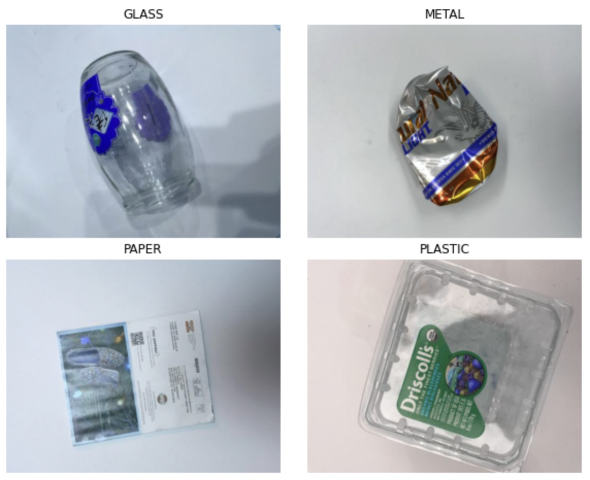
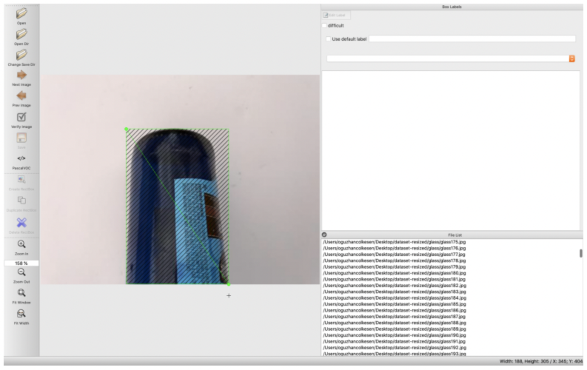
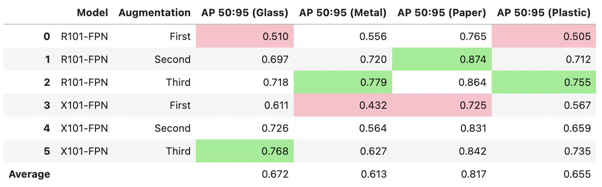
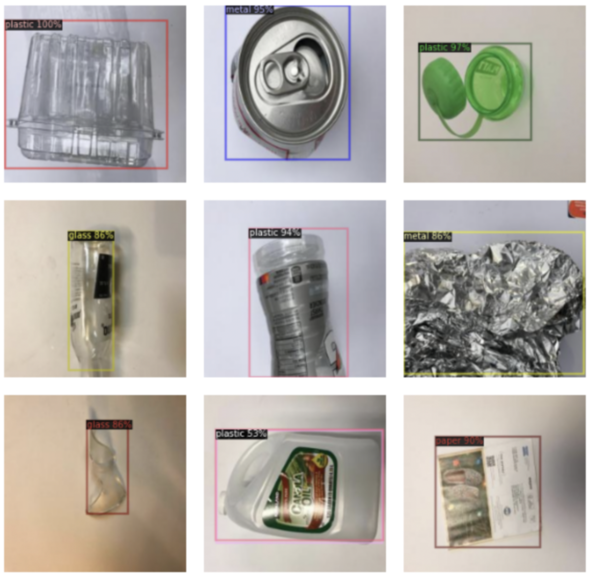

# Recycle-net

In this repository, we work with an image dataset of 4 different waste categories: glass, paper, plastic, and metal. We create an object detection model that will both locate and classify recycleable trash from an image. To do so, we use Facebook's detectron2 API to create our custom object detection model using transfer learning from detectron2's model zoo. Our study includes testing with two different base models that are implementing different approaches for object detection as well as analyzing the effect of different kinds of perturbations inserted in our training data on the performance of our models. The main file is `blog_post.ipynb`. 

## The Dataset

We found the dataset, TrashNet, online, which was created by two students at Stanford University for an image classification model [Github link](https://github.com/garythung/trashnet). Here are some example images from the dataset.

<!--  -->

Because we are interested in building an object detection model instead of just an image classification model, our dataset has to have bounding boxes with respective labels (i.e. annotations) around the objects in the images. We could not find a pre-made dataset that has these annotations for recycleable trash; therefore, we used labelImg software to draw the bounding boxes manually for all 1969 images we used at the end. An example of how labelImg was used to create these bounding boxes can be seen in the screen shot below.

At the end of this step, we have created 1971 annotations for 1969 images, which are distributed across our four labels as follows.

| Recycling Type  | Number of Images |
| -------------   | :------------------:|
| Glass           | 586                |
| Metal           | 497               |
| Paper           | 477               |
| Plastic         | 411               |

## Data Pre-Processing

After we annotate our data, we need to convert the dataset into a format that detectron2 could use, which is a .json file. The structure of this .json file is that each entry has fields "image_id", "file_name", "height", "width", and "annotations" that holds a list of bounding boxes in that image. To assist us with this conversion, we used an online tool called Roboflow, which in addition to creating the .json files also splits our dataset into train, test, and validation sets and adds perturbations to the training data. We use Roboflow to resize all of our images to 250x250 pixels for faster training and smaller memory usage to not run into any memory issues during training.

We experiment with three kinds of perturbations to evaluate their effect on the performance of our models. The first variation includes:

* Vertical flip
* Horizontal flip
* 90 degrees rotation
* Rotation (-45% - 45%)
* Crop (0% - 20%)
* Brightness (-35% - 35%)

In the second variation, we introduce a new set of perturbations:

* Vertical flip
* Horizontal flip
* 90 degrees rotation
* Brightness (-35% - 35%)
* Static noise (Up to 5% of pixels)

In the third variation, we keep all the perturbations from the second variation except for static noise. This allows us to isolate the effect of adding noise as a data augmentation method on the model's performance.

Roboflow generates 3 perturbated versions of each of our training images. After downloading the generated dataset with its .json file, we do some changes to its format and add it to detectron2's data catalog.

## Experiments

Before starting the development of any models, it is important to understand the nature of the task at hand and what measures we want to evaluate our models on. First, it is important to understand that we cannot use the same metrics as with classification models, because we want to evaluate our models on both detecting objects and classifying them correctly. Therefore, we have to disregard the effect of any true negatives where the model correctly predicted the absence of an object, because we could create infinitely many regions where there was no object and the model did not detect anything. This is the reason why we cannot comment on object detection models' accuracy metric. However, we can evaluate our models on precision and recall because they do not involve true negatives in their formulas.

* Recall: How many objects that belong to a class have been correctly detected and labeled by the model.
* Precision: Of the questions the objects that have been detected and classified, how many of them actually correspond to an object, which belongs to that class.

Of the two metrics reported above, we are more interested in precision over recall given the context of identifying recycleable trash. In this context, it is less harmful to have a false negative than a false positive. Saying an object is plastic when that object is glass might result in reducing the efficiency of recycling process because there would be an additional need to filter the recycled items, driving the cost of recycling up. On the other hand, if a metal goes into a landfill, we certainly are not recycling up to our full potential, but it is more favorable to keep the recycling costs down to incentivize recycling in the long run.

Furthermore, there is an additional metric to consider in object detection models, which is related to how well the model draws the bounding boxes. This metric is called IoU (Intersection-over-Union), which is calculated by dividing the intersection of the actual and predicted bounding boxes by their union. This concept is illustrated by the figure below where the blue box represents the actual bounding box and the green box is the model's prediction of it. Note that an IoU value of 1 would correspond to a perfect overlap of the two boxes.

### 1. Model 1 (R101-FPN)

The first model we picked from detectron2's model zoo is the model that had second best bounding box AP over all COCO Object Detection models, R101-FPN. COCO (Common Objects in Context) is a large-scale object detection dataset with 330,000 images with a total 171 classification categories. We expect a model that performs well for COCO to transfer that knowledge for detecting objects and classification to our TrashNet dataset as well. Obviously, our dataset is small and object detection models require a lot of training to have a decent performance in detection as well as classification. Therefore, we believe a transfer learning approach is preferable within the context of our study.

Because of our transfer learning approach, there are not many hyperparameters we can change in our variations. Therefore, we experimented with three variations of data augmentation, which we explained above, using R101-FPN as our base model. We run this training for 2500 iterations as specified in detectron2's documentation. To replicate the results of this experiment, the code snippet below could be run with arguments 1 for the model parameter and {1,2,3} for the dataset to specify which version of data augmentation should be used.

### 2. Model 2 (X101-FPN)

The second model we picked from detectron2's model zoo is the model that had the best bounding box AP over all COCO Object Detection models, X101-FPN. According to the documentation in the model zoo, this model has 1% better bounding box precision than our first model, but it is twice as slow to train. We are interested in seeing how much performance difference does the training speed introduce within the context of our problem.

Similarly to our experimentaiton with the first transfer learning model, we experimented with three variations of data augmentation using X101-FPN as our base model and training for 2500 iterations. To replicate the results of this experiment, the code snippet below could be run with arguments 2 for the model parameter and {1,2,3} for the dataset to specify which version of data augmentation should be used.

### Performance for Individual Labels

Looking at the averages, paper is the label that our models were able to predict with the highest precision. So much so that the worst AP value for paper (0.725) is still above the average APs of all other labels. This means that our models did not confuse paper objects with any of the other labels most of the time. Compared to the other 3 categories, paper is the only 2 dimensional object for the most part, which certainly reduces the effect of any shadows or blurriness of the image creating a distinction specifically for paper objects. Moreover, paper objects usually have the straightest edges as opposed glass bottles, metal cans, or plastic boxes that have round edges. We believe that our models would pick up the fact that straight edges most probably correspond to paper, increasing its precision for paper objects.

All the other labels had similar AP values on average with metal being the worst. The slight imbalance of our dataset did not seem to affect the results, because plastic was the label with the fewest count and glass was the label with the highest count, but this did not seem to impact their precisions.

In addition, the maximum of each column is highlighted in green and the minima are highlighted in red. We can clearly see that all the minimum values occur when we are using the first augmentation method. This confirms our earlier analysis that said the first augmentation method does not perform well with varying IoU thresholds. On the other hand, the three of the four best performing results appear when we are using the R101-FPN (model 1) as our base model, justfying our choice of using it as our final best-performing model.

## Results

In this section, we will initialize an instance of the best-performing model from our experimentation and train it with the same method to generate sample inferences from the test set. We believe this is an engaging way to see how our model performs when it is detecting objects from unseen data. To generate sample inferences, you could run the same code snippet with an additional argument.

Overall, the object detection we built using transfer learning (R101-FPN) reached an average precision of 89.7% with the IoU-threshold at 0.5 and an average recall of 89.3% with the IoU-threshold between 0.5 and 0.95. In other words, our model could correctly detect and classify 9 out of 10 recycleable materials, and 9 out of 10 predictions our model does would be correct. We find these results satisfying. Using rotations and cropping, we could reach an average precision over 90% but it comes with a reduction in recall to 71.3%. However, that model might be preferable depending on the priorities of the application.

Our findings confirm our hypotheses that transfer learning is a viable method of building a model for a task like object detection of recycleable trash and that inserting perturbations bearing in mind the features of the dataset did help us optimize the model's performance by generating more data to train on and combatting overfitting.

While the results of this study are satisfying for our purposes, there is still room for improvement. There are 16 base models in detectron2's model zoo for object detection, and we only tested the most promising 2 out of that 16. As we discussed above, the better performance on the COCO dataset does not guarantee better performance on our TrashNet, so experimenting with different models from the model zoo could yield even better results. Additionally, most of the images in TrashNet had only one object in them, because it was initially created for image classification models. Therefore, it could be beneficial to expand upon the dataset by taking more pictures with multiple objects in the same picture to increase our model's performance when there are multiple objects in the frame.

We would also like to expand our project into the real world, which could be another avenue for future work and raise awareness for recycling. To do so, we would set up a station in Alvarez College Union with a camera that would feed images to our model and a monitor that would display our model's predictions. This could also help with our data collection if we save the images for further training of our model over time. We could even allow people to give feedback on the accuracy of the predictions and improve the model over time.

## References

* https://app.roboflow.com/ | We used Roboflow to generate .json files from our images and individual annotations as well as to generate different variations of data augmentation.
* https://curiousily.com/posts/face-detection-on-custom-dataset-with-detectron2-in-python/ | We learnt the specifics of implementing an object detection model using detectron2 API.
* https://www.kaggle.com/dhiiyaur/detectron-2-compare-models-augmentation | This Kaggle notebook introduced us to detectron2 and persuaded us to use it over Tensorflow's object detection API.
* https://towardsdatascience.com/evaluating-performance-of-an-object-detection-model-137a349c517b | We learnt about how to interpret the performance metrics of an object detection model and got our IoU figure from this website.
* https://colab.research.google.com/drive/1-TNOcPm3Jr3fOJG8rnGT9gh60mHUsvaW#scrollTo=WiJ0Ylc_XAUa | We got the code for CocoTrainer from this guide
* https://github.com/facebookresearch/detectron2/blob/master/MODEL_ZOO.md | We got our base models from this Zoo and learnt about their AP values on the COCO dataset.
* https://towardsdatascience.com/object-detection-in-6-steps-using-detectron2-705b92575578 | We learnt the format of the .json file required for detectron2 and processed the data following this guide.
* https://github.com/garythung/trashnet | We got our data from here.
* https://arxiv.org/pdf/1611.10012.pdf | The paper by Huang et al. that talks about the correlation between AP50 and AP75.

